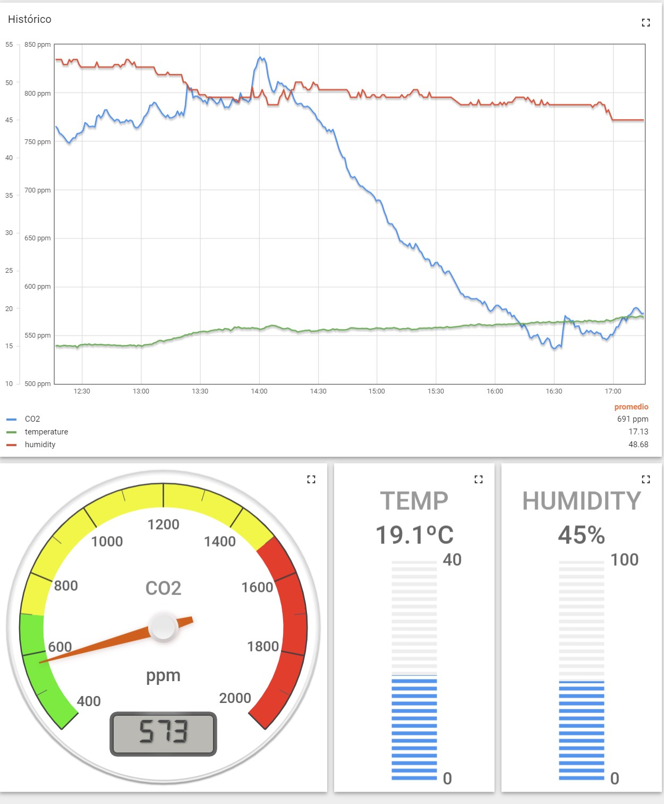
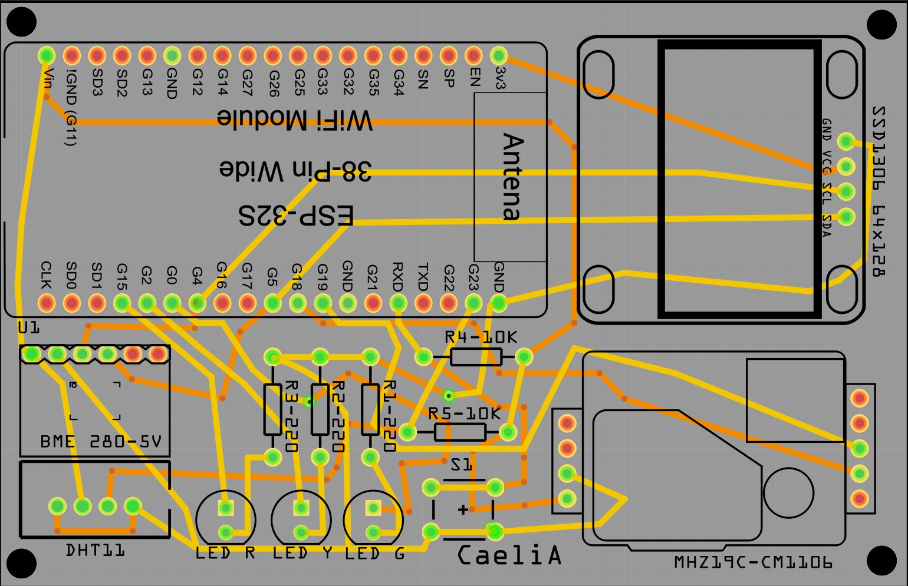

# CaeliA-Device

## Device using MHZ19 and DHT11 sensors


## Device using CM1106 and BME280 sensors

.jpg)

This project describes the design of a CO2 metering for deployment in schools and other public and private places.

The device takes CO2 as well as other environmental readings periodically and publishes them using mqtt to a cloud platform.
The device is equiped with a display and some indicator leds in order to also allow local operation and to signal the warning
CO2 levels.

The device was built using an ESP32 nodemcu and utilizes two sensors:
* MHZ19 or CM1106 CO2 sensor: 
    - An NDIR co2 sensor that supports a serial UART interface.
* DHT11 or BME280 Humidity and Temperature sensor: 
    - The sensor provides temperature and humidity and is interfaced though a PWM
* The software is designed to automatically detect which sensor is present and will use the corresponding sensor for CO2, temperature and humidity.

The device needs a wifi hotspot to connect to Internet and publish the readings.

In order to connect, the device uses the [WifiManager library](https://github.com/tzapu/WiFiManager) to request from the user the connection parameters. 

* On first instalation, the device will start a captive portal AP and request the following:
    - WiFi SSID
    - WiFi password
    - MQTT broker address
    - MQTT broker port
    - MQTT topic
    - URL to check for software updates.
* After parameters are set, the device will connect automatically without user intervention. Parameters are persisted
in the flash SPFFS file system and will be recovered in subsequent reboots.
* The user can force the device to raise the captive portal upon powerup to change any of the existing parameters.

# Calibration

NDIR CO2 sensors must be periodically calibrated to compensate drifts. The device supports three methods:

* Autocalibration (on by default): Whe operating under normal conditions, in operation the device assumes that at some point during a 24h period there will be a base level concentratio (approx. 400ppm) and uses that point to calibrate. 

* Manual calibration: Pressing the multipurpose button while the device is on operation in a base level CO2 concentration will force the device to follow a calibration cycle

* Sending a command from the server (see RPC commands).

The device uses the [fota library](https://github.com/chrisjoyce911/esp32FOTA) library for over the air updates. In will regularly check for firmware updates by checking current firmware version against the version recorded in the sw server.
In the case there is a new version it will download and install it unattended.

# Configuration

When the device stars up it recovers the configuration stored in flash memory and tries to connect. If it succeds i proceeds with the setup and follows to start taking readings from the sensor and publishing them via mqtt. The reading cycle takes place every 20s although it is easy to change.

Onece selected the AP of the arduino board the following screens allo you to configure the different parameters:


.jpg)

# OTA software update

The device checks periodically a json file stored in a web server, to verify if there is a newer version than the current software loaded on the device. The file also points to the location of the sw which can be stored in a different server. 

```
{
    "type": "CaeliA_esp32_co2",
    "version": 1,
    "host": "192.168.1.200",
    "port": 80, 
    "bin": "/fota/CaeliA_Device.ino.esp32.bin"
}
```


# MQTT Cloud platform

CaeliA device is conceived as a device used to publish into a cloud platform. The cloud platform can also be used to manage the device.

Data on the device can be visualized thoug dashboards such as:



The current platform used is ThingsBoard which allows also also to issue RPC commands that the device can interpret. Curtrently the following
RPC calls over MQTT are implemented:

```
setOffset: Add offset to CO2 reading#define DBG_ENABLE_ERROR
calibration: Zero calibration of  device (400 ppm)
autoCalibration: turn autocalibration  on/off
userMessage: Display a message for the user
setLedState: Force LEDs on(2)/off(0)/warning_level(1)
setWarnings: Define warning and danger levels
autoCalibration: turn the autocalibration mode on=true or off=false
version: the device will respond with the uptime and the version number
updateFirmware: the device will load new firmware from the host and filedescriptor parameters
```
 
# Schematics of the device:


# and the PCB




